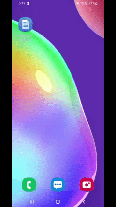
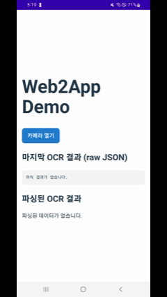
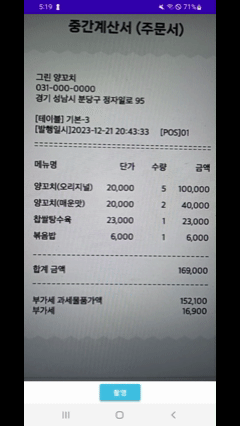

# web2app-android (React PWA → Android WebApp)

React 기반 웹 앱(PWA)에 네이티브 카메라 OCR(광학 문자 인식) 기능을 연동하기 위해 개발된 Android 하이브리드 앱입니다.
WebView 내에서 웹 콘텐츠는 JavaScript Bridge를 통해 네이티브 카메라 기능을 호출하며, 촬영된 이미지에서 인식된 한국어 텍스트 결과는 비동기적으로 다시 웹뷰로 전달됩니다.
기존 웹 서비스를 최대한 재사용하면서 카메라·OCR 같은 네이티브 기능을 점진적으로 통합하는 데모 프로젝트입니다.

---

## 🎬 데모 시연 (GIF)

### 1. 앱 실행 & PWA 로딩

사용자가 앱을 실행하면, 곧바로 React 기반 PWA 웹앱이 WebView로 로드됩니다.



- 스플래시 이후 별도 네이티브 화면 없이 바로 웹앱 홈으로 진입  
- PWA의 네비게이션/라우팅을 그대로 활용

---

### 2. 웹에서 카메라 열기 (window.Android.startCamera)

웹 화면의 버튼을 누르면 JS에서 `window.Android.startCamera()`를 호출하고,  
네이티브 `CaptureActivity`가 실행됩니다.



- 웹 버튼 클릭 → JS 브리지 → 네이티브 화면 전환  
- 멀티 모듈 구조에서 `:app` 모듈이 네비게이션을 조율

---

### 3. 촬영 & OCR 결과를 웹으로 되돌리기 (window.onOcrResult)

카메라로 촬영한 이미지를 ML Kit Korean Text Recognition으로 OCR 처리한 뒤,  
결과를 JSON으로 직렬화하여 `window.onOcrResult(json)`으로 웹에 다시 전달합니다.



- 네이티브에서 추출한 텍스트 → JSON 변환  
- WebView 내 JS 함수 호출로 웹 UI 업데이트

---

## ✨ 주요 기능

- **기존 React PWA 웹앱을 그대로 재사용**
  - `WebView + PWA_URL` 로 앱스토어 배포 가능한 하이브리드 앱 구현
- **JS 브리지 기반 네이티브 연동**
  - `window.Android.startCamera()` → 네이티브 카메라 화면 호출
  - `window.onOcrResult(json)` → 네이티브 OCR 결과를 웹에 전달
- **카메라 & OCR 기능**
  - `CameraX` 기반 실시간 프리뷰 + 캡처
  - `ML Kit Text Recognition (Korean)` 으로 텍스트 OCR
- **멀티 모듈 아키텍처**
  - `:app` / `:core` / `:feature-webview` / `:feature-capture`
  - feature 간 의존 없이 `core`를 통한 느슨한 결합

---

## 🏗 아키텍처 개요

### 모듈 구조

```text
web2app-android
├─ app                # 엔트리 포인트, 네비게이션, DI/조율
├─ core               # 공통 모델, 유틸, 인터페이스 (OcrResult, OcrResultBus, CameraLauncher 등)
├─ feature-webview    # PWA WebView + JS 브리지(AndroidJsBridge, WebViewFragment)
└─ feature-capture    # CameraX + ML Kit OCR (CaptureActivity)
```

### 의존성 방향
```text
app
 ├─▶ core
 ├─▶ feature-webview
 └─▶ feature-capture

feature-webview ─▶ core
feature-capture ─▶ core

# feature ↔ feature 직접 의존 없음
```


## 🏗 아키텍처 모듈 설명 (표)

### 모듈별 역할 요약

| 모듈 | 핵심 책임 | 포함 파일 / 구성요소 | 외부 의존성 | 비고 |
|------|-----------|------------------------|---------------|-------|
| **core** | 공통 모델, 유틸, 추상화 인터페이스 | `OcrResult`, `OcrResultBus`, `CameraLauncher` | 없음 (Android Framework/CameraX/WebView에 의존 금지) | feature와 app의 공유 기반. DIP 준수 핵심 |
| **app** | 네비게이션 조율, Host Activity, BuildConfig(PWA_URL) 생성 | `MainActivity` (CameraLauncher 구현), DI(간단한 연결) | feature-webview, feature-capture, core | 앱 전체의 orchestration 담당 |
| **feature-webview** | PWA WebView 로딩, JS ↔ Android 브리지 | `WebViewFragment`, `AndroidJsBridge` | core | WebView에서 JS 기능 확장 담당 |
| **feature-capture** | CameraX 촬영 + ML Kit OCR 처리 | `CaptureActivity` | core, CameraX, ML Kit | 결과를 JSON으로 만들어 core로 전달 |

---

### core 모듈 상세

| 구성 요소 | 역할 | 비고 |
|-----------|------|-------|
| **OcrResult** | OCR 결과를 표현하는 모델 데이터 클래스 | 네이티브→웹 데이터를 JSON으로 만드는 기반 |
| **OcrResultBus** | `SharedFlow<String>` 기반 이벤트 버스 | 네이티브 OCR 결과를 WebViewFragment에 전달 |
| **CameraLauncher** | `fun launchCamera()` 단일 인터페이스 | WebViewFragment가 Activity를 직접 참조하지 않도록 분리된 추상화 |

---

### app 모듈 상세

| 구성 요소 | 역할 | 비고 |
|-----------|------|-------|
| **MainActivity** | CameraLauncher 구현, PWA WebViewFragment attach, 뒤로가기 처리 | 네비게이션 흐름의 중심 |
| **BuildConfig.PWA_URL** | `local.properties`에서 `pwa.url` 읽어 주입 | 환경별 PWA URL 분리 가능 |

---

### feature-webview 모듈 상세

| 구성 요소 | 역할 | 비고 |
|-----------|------|-------|
| **WebViewFragment** | PWA 로딩, 브리지 등록, OcrResultBus collect → JS 호출 | 실질적으로 “웹앱을 네이티브 앱처럼 보이게 하는 핵심” |
| **AndroidJsBridge** | 웹에서 `window.Android.startCamera()` → CameraLauncher 호출 | JS ↔ Android 다리 역할 |

---

### feature-capture 모듈 상세

| 구성 요소 | 역할 | 비고 |
|-----------|------|-------|
| **CaptureActivity** | CameraX 프리뷰/촬영, ML Kit OCR, JSON 생성, OcrResultBus.post | 네이티브 기능(카메라 + OCR) 담당 |
| **CameraX / ML Kit dependency** | 카메라 + OCR 기능 제공 | core에서는 사용하지 않음 (DIP 준수) |

---

###🔁 PWA ↔ 네이티브 연동 흐름

앱 실행

MainActivity → WebViewFragment attach

WebView 가 PWA_URL 로 React 웹앱 로딩

웹 → 네이티브 (JS → Android)

// PWA 내부 예시 코드
function onScanButtonClick() {
  if (window.Android?.startCamera) {
    window.Android.startCamera();
  }
}


window.Android.startCamera() 호출

AndroidJsBridge.startCamera() → CameraLauncher.launchCamera()
→ MainActivity 가 CaptureActivity 실행

네이티브 OCR 처리

CaptureActivity:

CameraX로 촬영

ML Kit Korean Text Recognition으로 OCR

{ id, rawText, createdAt } JSON 문자열 생성

OcrResultBus.post(json) 호출

네이티브 → 웹 (Android → JS)

WebViewFragment:

OcrResultBus.resultFlow 구독 (viewLifecycleOwner.lifecycleScope)

새 JSON 수신 시:

webView.evaluateJavascript("window.onOcrResult(${json});", null)


PWA:

window.onOcrResult = function (json) {
  const result = JSON.parse(json);
  // 화면 상태 업데이트 (예: 분석 결과 카드 렌더링)
};


이러한 방식으로 PWA를 그대로 유지하면서, 필요한 부분만 네이티브로 점진적으로 확장할 수 있습니다.

🛠 기술 스택

Language

Kotlin (JVM, Kotlin 2.x)

Android

Android Application / Library (AGP 8.x)

AndroidX AppCompat, Fragment, Lifecycle

ViewBinding / View 기반 UI + WebView

UI

WebView (React PWA 임베딩)

Camera / ML

CameraX (PreviewView, ImageCapture)

ML Kit Text Recognition (Korean)

아키텍처

Multi-module (app/core/feature-*)

Interface 기반 의존성 역전 (CameraLauncher, OcrResultBus)

Event-driven (SharedFlow)

🚀 빌드 & 실행 방법

이 레포지토리를 클론합니다.

git clone https://github.com/your-account/web2app-android.git
cd web2app-android


Android Studio (Giraffe / Koala / Otter 이상) 로 web2app-android 폴더를 엽니다.

Gradle Sync가 완료될 때까지 대기합니다.

실행 타겟(에뮬레이터 또는 실제 디바이스, Android 8.0+/API 26 이상) 선택 후 Run 버튼 클릭.

앱이 실행되면 PWA 화면이 로드되고, 웹에서 카메라를 호출해 시연할 수 있습니다.

## 🌐 PWA URL 설정 (local.properties)

이 프로젝트는 PWA URL을 코드에 하드코딩하지 않고,  
`local.properties` 파일에서 값을 읽어와 `BuildConfig`로 주입하여 WebView에서 사용합니다.

### 1) local.properties 설정

Android Studio 프로젝트 루트에 있는 `local.properties` 파일에 다음 항목을 추가하세요:

pwa.url=https://example.com


> 실제 PWA 주소로 변경해 사용합니다.  
> 이 값은 Git에 커밋되지 않기 때문에 민감한 테스트 URL을 안전하게 사용할 수 있습니다.

---

### 2) build.gradle.kts 에서 BuildConfig 로 주입

`app/build.gradle.kts`에는 이미 다음 코드가 포함되어 있어야 합니다:

```kotlin
defaultConfig {
    // ...

    val pwaUrl: String = project.findProperty("pwa.url")?.toString() ?: ""
    buildConfigField("String", "PWA_URL", "\"$pwaUrl\"")
}

3) WebViewFragment에서 읽어 사용
private val pwaUrl = BuildConfig.PWA_URL

📌 TODO / 향후 개선

 실제 PWA URL 연동 및 QA

 ML Kit OCR 결과를 기반으로 한 도메인 모델링

 Jetpack Compose 기반의 네이티브 전용 화면 추가

 Hilt 또는 Koin 도입으로 DI 구조 명시화

 에러 처리/오프라인 모드/PWA 캐싱 전략 고도화

---
